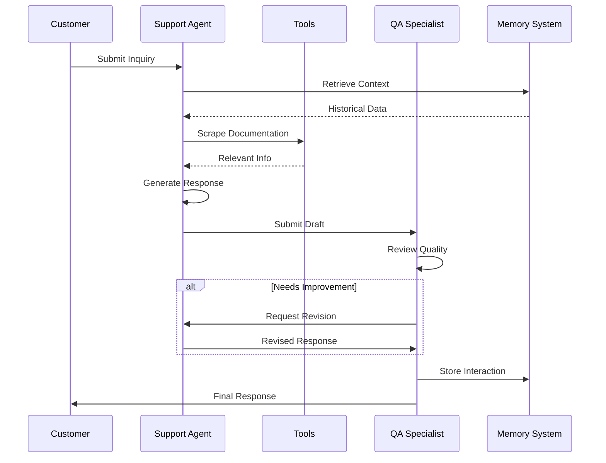
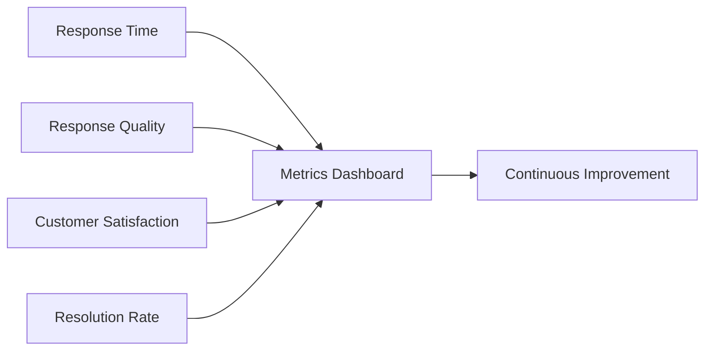

# 🤖 AI Agent Support Crew

A sophisticated multi-agent customer support automation system built with CrewAI that leverages AI agents for intelligent, context-aware customer service.


## 📋 Table of Contents

- [Overview](#overview)
- [Features](#features)
- [Installation](#installation)
- [Configuration](#configuration)
- [Project Structure](#project-structure)
- [How It Works](#how-it-works)
- [Example Output](#example-output)

## 🎯 Overview

This project implements an intelligent multi-agent system for automating customer support operations. Using CrewAI's framework, it orchestrates two specialized AI agents that collaborate to provide high-quality, comprehensive customer support responses.

The system is designed to:
- Handle complex customer inquiries with context awareness
- Provide accurate, well-researched responses using documentation scraping
- Ensure quality through automated review processes
- Maintain conversation memory for contextual understanding

## ✨ Features

### 🎭 **Role Playing**
- Agents adopt specific personas (Support Representative & QA Specialist)
- Each agent has defined goals and backstories for realistic interactions

### 🎯 **Focus**
- Agents stay on task with clear, specific objectives
- Goal-oriented behavior ensures relevant responses

### 🛠️ **Tools Integration**
- **Web Scraping**: Accesses documentation in real-time
- **Search Capabilities**: Finds relevant information quickly
- **Custom Tools**: Extensible architecture for adding new capabilities

### 🤝 **Cooperation**
- Multi-agent collaboration through delegation
- Quality assurance agent reviews and improves responses

### 🛡️ **Guardrails**
- Built-in quality checks and validations
- Ensures responses meet high standards

### 🧠 **Memory**
- Short-term memory for conversation context
- Long-term memory for learning from past interactions
- Entity memory for tracking customer information


## 🚀 Installation

### Prerequisites

- Python 3.8 or higher
- OpenAI API key
- pip package manager

### Step-by-Step Setup

1. **Clone the repository**
   ```bash
   git clone https://github.com/iitsh/AI-AGENT-Support-Crew.git
   cd AI-AGENT-Support-Crew
   ```

2. **Create a virtual environment** (recommended)
   ```bash
   python -m venv venv
   source venv/bin/activate  # On Windows: venv\Scripts\activate
   ```

3. **Install dependencies**
   ```bash
   pip install crewai==0.28.8 crewai_tools==0.1.6 langchain_community==0.0.29
   pip install python-dotenv jupyter
   ```

4. **Set up environment variables**
   ```bash
   cp .env.example .env
   # Edit .env and add your OpenAI API key
   ```

## ⚙️ Configuration

### Environment Variables

Create a `.env` file in the root directory:

```env
OPENAI_API_KEY=your_openai_api_key_here
```

### Agent Configuration

The system uses two agents with the following configuration:

**Senior Support Representative**
- **Role**: Primary customer interaction
- **Goal**: Provide friendly and helpful support
- **Delegation**: Cannot delegate tasks
- **Verbose**: Enabled for detailed logging

**Support Quality Assurance Specialist**
- **Role**: Quality control and review
- **Goal**: Ensure best support quality
- **Delegation**: Can delegate back to support agent
- **Verbose**: Enabled for detailed logging


## 📁 Project Structure

```
AI-AGENT-Support-Crew/
│
├── .env                              # Environment variables (API keys)
├── .gitignore                        # Git ignore file
├── utils.py                          # Utility functions
├── customer_support_automation.ipynb # Main notebook
│
├── README.md                         # This file
└── requirements.txt                  # Python dependencies
```

## 🔍 How It Works

### Agent Workflow



### Memory System

The system implements three types of memory:

1. **Short-term Memory**: Maintains context during the current conversation
2. **Long-term Memory**: Stores successful response patterns for future use
3. **Entity Memory**: Tracks customer-specific information

### Tool Integration

The system uses specialized tools:

- **ScrapeWebsiteTool**: Extracts information from documentation
- **SerperDevTool**: Enables web search capabilities
- **WebsiteSearchTool**: Searches within specific websites

## 💡 Example Output

### Input Query
```python
{
    "customer": "DeepLearningAI",
    "person": "Andrew Ng",
    "inquiry": "I need help with setting up a Crew and adding memory to it."
}
```

### Generated Response
```
Hello DeepLearningAI Team,

Thank you for reaching out about how to add memory to your crew...

1. **Building the Basics:**
   - Agents: Create agents with tools, memory, and knowledge...
   - Flows: Orchestrate steps for managing state...
   - Tasks & Processes: Define structured processes...

2. **Implementing Memory:**
   - Memory Storage Mechanism: Implement storage for context retention...
   - Persistent Storage Tools: Leverage tools for persistent solutions...

[Full detailed response with examples and best practices]

Cheers,
[Senior Support Representative]
CrewAI Support Team
```

## 🎨 Key Features Breakdown

### 1. Role-Based Specialization
Each agent has a specific role, ensuring expertise in their domain:
- Support agents focus on customer interaction
- QA specialists ensure response quality

### 2. Dynamic Tool Usage
Agents can access tools as needed:
- Documentation scraping for accurate information
- Web search for current data
- Custom tools for specific tasks

### 3. Quality Assurance Loop
Built-in review process ensures:
- Comprehensive answers
- Accurate information
- Friendly, professional tone
- Complete coverage of customer questions

### 4. Memory-Enhanced Responses
The system learns and improves:
- Remembers past successful interactions
- Builds knowledge about customers
- Improves over time with each interaction


## 📊 Performance Metrics

The system tracks key performance indicators:




## 🙏 Acknowledgments

- [CrewAI](https://crewai.com) - Multi-agent framework
- [OpenAI](https://openai.com) - Language models

## 📧 Contact

Email : rayane06berrada@gmail.com

---

<div align="center">

**⭐ Star this repository if you find it helpful!**

Made with ❤️

</div>
